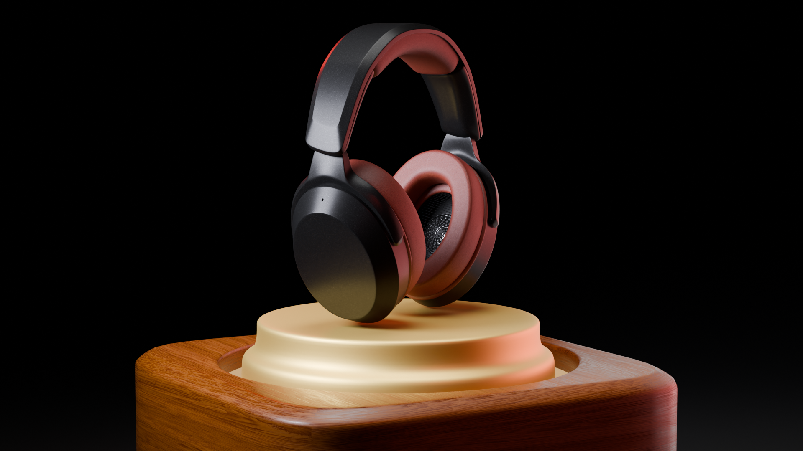
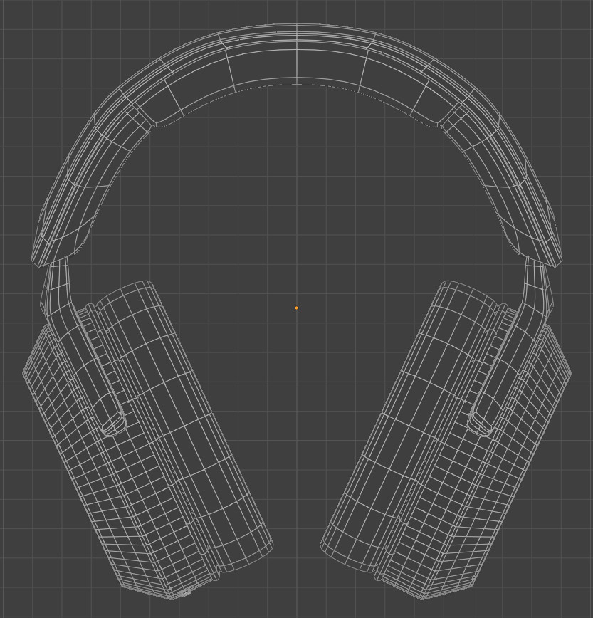
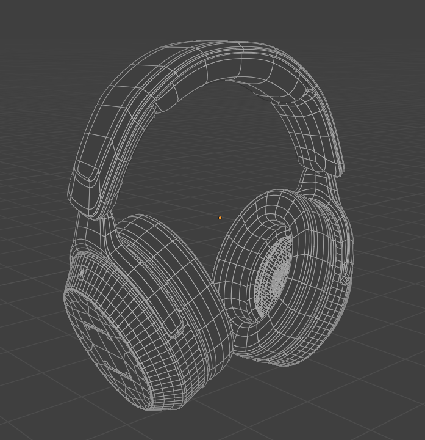
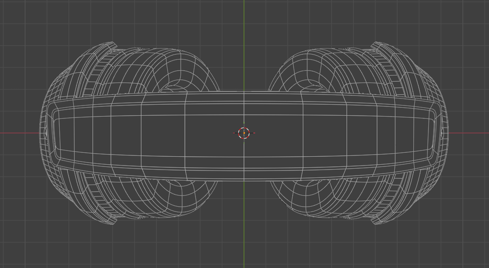

# 🎧 Headphone Product Animation — Blender

A cinematic product animation of a custom-designed headphone model, built entirely from scratch in Blender. The project covers the full 3D production pipeline — from initial modeling and retopology through to UV mapping, texturing, lighting, and multi-camera animation rendered in Cycles.

---

## 📸 Preview

| Render 1 | Render 2 
|----------|----------|
|  |  |

---

## 🎬 Animation Breakdown

The final animation sequence features three distinct camera cuts:

- **Establishing Drop** — The headphones descend dramatically onto a glowing gold and wood pedestal
- **Macro Detail Shot** — A close-up pass highlighting the leather cushions and material detail
- **360° Showcase Rotation** — A smooth full rotation revealing every angle of the model

---

## 🛠️ Production Pipeline

### 1. Modeling
- Built from scratch using hard surface modeling techniques in Blender
- Full **retopology** pass for clean, optimized quad-based geometry
- Subdivision-ready topology that holds up under any camera angle

### 2. UV Mapping
- Complete **UV unwrap** across all components
- Seams placed strategically to minimize visible stretching
- Separate UV islands for headband, ear cups, and base pedestal

### 3. Texturing & Materials
- **Leather bump maps** on the ear cushions for realistic surface detail
- **Wood grain texture** on the base pedestal with accurate light interaction
- Physically based materials (PBR) throughout for realistic light response
- Gold emission material on the inner pedestal rim for the signature glow
- All textures packed directly into the `.blend` file

### 4. Lighting
- Three-point lighting setup with warm and cool contrast
- Area lights positioned to emphasize the product silhouette
- Emission geometry on the pedestal for the signature warm underglow

### 5. Rendering
- Rendered using **Blender Cycles** engine for physically accurate ray tracing
- High sample count for clean, noise-free output
- Multiple **camera instances** for seamless commercial-style cuts

### 6. Animation
- Keyframed descent animation for the dramatic product drop
- Smooth 360° rotation using a driver-based turntable setup
- Camera transitions timed for a polished commercial feel

---

## 🔧 Software & Tools

| Tool | Purpose |
|------|---------|
| **Blender 3.x / 4.x** | Modeling, rigging, animation, rendering |
| **Cycles Engine** | Physically accurate rendering |
| **Blender UV Editor** | UV unwrapping and seam placement |
| **Shader Editor** | PBR material creation |
| **Video Sequence Editor** | Final sequence assembly |

---

## 🖼️ Wireframes

Clean quad topology across all views — ensuring the geometry holds up under subdivision and close-up camera work.

| Front Orthographic | Close-up 3/4 View | Top-Down |
|-------------------|------------------|----------|
|  |  |  |

---

## 💡 Key Learnings

- Retopology flow around complex curved surfaces like ear cups requires careful edge loop planning to avoid pinching under subdivision
- Physically based leather materials benefit significantly from a subtle normal map layered on top of the bump map for micro-surface detail
- Using multiple camera objects with animated visibility flags is cleaner than animating a single camera for multi-cut commercial sequences

---

## 📬 Contact

Interested in 3D product visualization or animation work?

- **LinkedIn:** [Parth Joshi](linkedin.com/in/parth-joshi-555943245)
- **Instagram:** [parthjoshi007](https://www.instagram.com/parthjoshi007/)
- **Email:** parthjoshi910@gmail.com

---

> *Built with patience, polygons, and too many render passes.* 🖤
